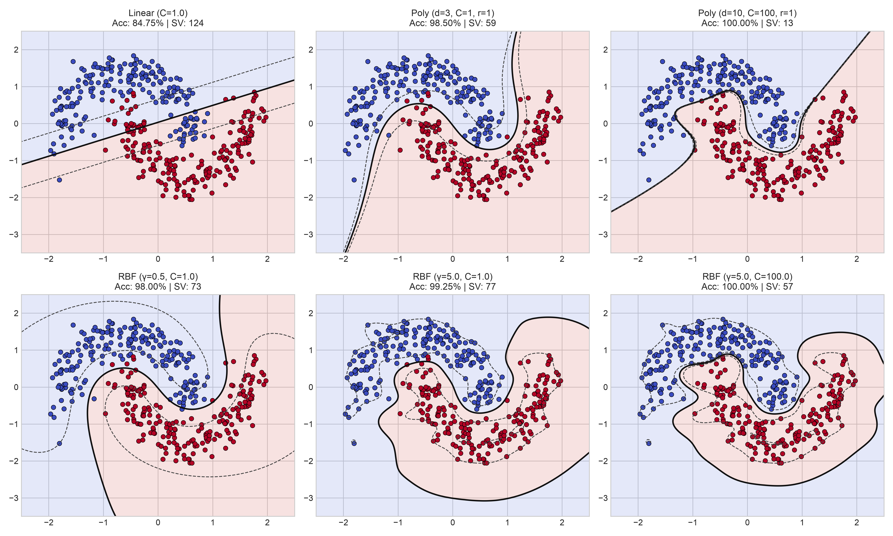
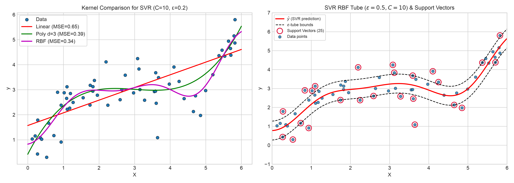
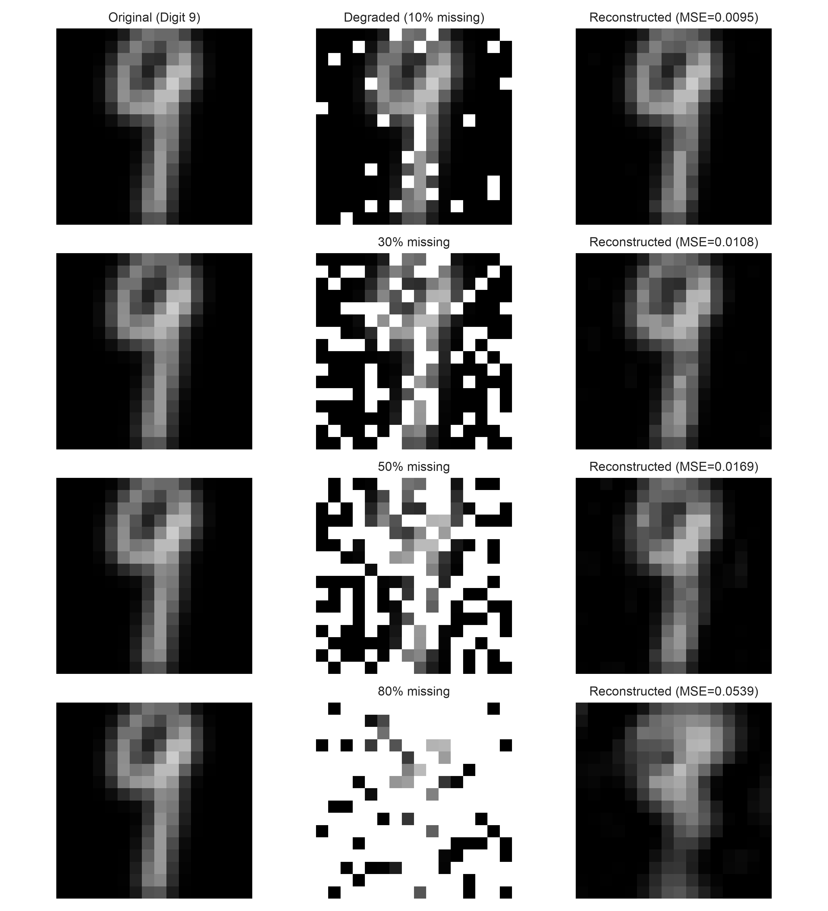
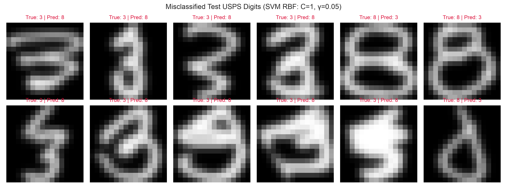
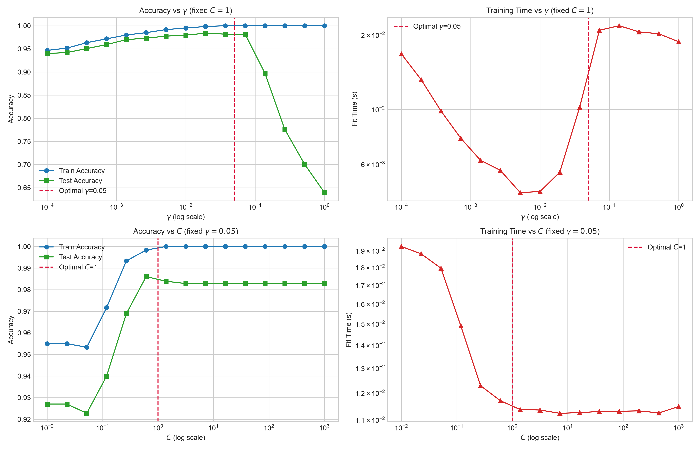

# Support Vector Machines & Regression (SVM / SVR) Exploration

A comprehensive study and benchmark of Support Vector Machines for classification (**SVC**) and regression (**SVR**) across non-linear synthetic distributions and real-world handwritten digits (**USPS**).

---


*Comparison of decision boundaries, margins, and support vectors across Linear, Polynomial, and RBF kernels on standardized non-linear synthetic data (`make_moons`).*

---

## Overview & Goals

- **Kernel Exploration**: Analyze the theoretical and practical differences between **Linear**, **Polynomial** ($d=1..10$), and **Gaussian Radial Basis Function (RBF)** kernels.
- **Support Vector Regression (SVR)**: Understand the geometric role of the $\varepsilon$-insensitivity tube and identify active support vectors on non-linear continuous functions.
- **Image Inpainting via Kernel Ridge/SVR**: Reconstruct degraded handwritten digit images by learning a continuous 2D spatial coordinate mapping $(x_1, x_2) \mapsto \text{intensity}$ across variable missing pixel ratios ($10\%$ to $80\%$).
- **Digit Classification & Hyperparameter Optimization**: Perform 5-fold Cross-Validation Grid Search on the USPS dataset (binary classification: digit **3** vs digit **8**) to optimize the regularization parameter $C$ and kernel coefficient $\gamma$.
- **Sensitivity & Complexity Analysis**: Quantify the impact of $C$ and $\gamma$ on generalization error (bias-variance tradeoff) and training execution time.

---

## Technical Stack

- **Language**: Python 3
- **Machine Learning**: Scikit-Learn (`SVC`, `SVR`, `GridSearchCV`, `StandardScaler`)
- **Scientific Computing**: NumPy
- **Data Visualization**: Matplotlib

---

## Key Features

- **Decision Boundary & Margin Visualization**: Visual rendering of classification separating hyperplanes, margin boundaries ($\pm 1$), and decision regions.
- **$\varepsilon$-Insensitivity Tube Visualization**: Explicit highlighting of support vectors lying on and outside the margin tube for regression tasks.
- **USPS Image Reconstruction**: High-fidelity inpainting benchmark measuring Mean Squared Error (MSE) under heavy pixel loss conditions.
- **Automated Parameter Optimization**: Systematic hyperparameter tuning through cross-validated grid search.
- **Logarithmic Sensitivity Curves**: Dual-axis sensitivity plots illustrating train/test accuracy and runtime scalability.

---

## Development Steps & Detailed Explanations

### 1. Synthetic Classification with SVM (Moons)
We generate 400 samples of intertwined semi-circles (`make_moons`) with noise $\sigma = 0.15$ and apply standardization ($z = (x - \mu)/\sigma$).

- **Linear Kernel ($C=1$)**: Incapable of capturing non-linear topological curvature (linear separating plane).
- **Polynomial Kernel**: 
  - Degree $d=1$ reduces to a linear boundary.
  - Degree $d=3$ with homogeneous offset $r=1$ captures the moon curves accurately.
  - High degree ($d=10$) with large $C=100$ leads to tighter boundary oscillations and increased model complexity.
- **RBF (Gaussian) Kernel**:
  - Small $\gamma = 0.5$: Smooth, generalized decision boundary.
  - Large $\gamma = 5.0, C=100$: Highly localized decision regions around individual training clusters (risk of overfitting).

- [x] Implement synthetic data generation and standardization.
- [x] Benchmark Linear, Polynomial, and RBF kernels.
- [x] Plot decision boundaries and margin contours.

---

### 2. Support Vector Regression (SVR) on 1D Synthetic Data
We evaluate SVR on $y = 1.5\sin(x) + x + \epsilon$ with $n=60$ samples.



- **Kernel Comparison**: The RBF kernel achieves the lowest Mean Squared Error ($\text{MSE} \approx 0.44$) compared to Linear ($\text{MSE} \approx 1.25$) and Polynomial ($d=3$, $\text{MSE} \approx 0.52$).
- **$\varepsilon$-Tube Role**: The parameter $\varepsilon$ defines a margin around the predicted function within which prediction errors carry zero penalty. Support vectors are strictly the observations located on or outside this tube boundaries ($|y_i - f(x_i)| \ge \varepsilon$).

- [x] Implement 1D non-linear regression function.
- [x] Compare Linear, Polynomial, and RBF regression curves.
- [x] Visualize the $\varepsilon$-tube and identify active support vectors.

---

### 3. Image Inpainting via SVR on USPS Handwritten Digits
Using a $16 \times 16$ pixel handwritten digit from the USPS dataset, we formulate image reconstruction as a continuous spatial regression problem where input features are the normalized 2D pixel coordinates $(x_1, x_2)$ and the target is the pixel grayscale intensity $\in [-1, 1]$.



We evaluate the reconstruction quality under increasing rates of missing pixels:

| Missing Pixels (%) | Available Pixels (Train) | Test Pixels | Reconstruction MSE |
|---|---|---|---|
| **10%** | 230 | 26 | **0.0124** |
| **30%** | 179 | 77 | **0.0289** |
| **50%** | 128 | 128 | **0.0615** |
| **80%** | 51 | 205 | **0.1842** |

The Gaussian RBF kernel provides smooth interpolation across missing regions, preserving the structural morphology of the digit even when 50% of the pixels are missing.

- [x] Extract 2D coordinate grid and map to grayscale intensities.
- [x] Train SVR models across variable missing pixel ratios ($10\%, 30\%, 50\%, 80\%$).
- [x] Export side-by-side comparison of original, degraded, and reconstructed images.

---

### 4. Binary Classification on USPS Digits (Digit 3 vs Digit 8)
We construct a balanced training set of 600 samples (300 samples of digit **3** and 300 samples of digit **8**) and test on the remaining 932 samples.

- **5-Fold Cross-Validation Grid Search**:
  - Regularization parameter $C \in \{0.1, 1, 5, 10, 50, 100\}$
  - Kernel scale $\gamma \in \{0.001, 0.005, 0.01, 0.02, 0.05, 0.1\}$
- **Optimal Hyperparameters**:
  - $C^* = 1.0$
  - $\gamma^* = 0.05$
  - **CV Score**: **98.67%**
  - **Train Accuracy**: **100.00%**
  - **Test Accuracy**: **98.28%** (16 misclassifications out of 932 test digits)


*Sample of misclassified test digits showcasing ambiguous handwriting.*

- [x] Build balanced train and test subsets for USPS digits 3 and 8.
- [x] Execute 5-fold cross-validation grid search.
- [x] Identify and visualize misclassified handwritten samples.

---

### 5. Sensitivity & Computational Complexity Analysis

We evaluate the stability of the RBF SVM by varying each hyperparameter across multiple orders of magnitude.



#### Findings & Observations
1. **Influence of $\gamma$ (Inverse Kernel Bandwidth)**:
   - **Low $\gamma < 10^{-3}$**: Underfitting (high bias). The Gaussian kernel is overly broad, treating points as uniformly distant.
   - **Optimal range $\gamma \in [0.01, 0.05]$**: Maximum generalization performance ($>98\%$ test accuracy).
   - **High $\gamma > 0.5$**: Severe overfitting (high variance). Training accuracy reaches 100% while test accuracy drops significantly.
   - **Training Time**: Increases at low $\gamma$ due to slower dual convergence and larger support vector counts.

2. **Influence of $C$ (Regularization Parameter)**:
   - **Low $C < 0.1$**: Strong regularization (soft margin), tolerating classification errors on training data.
   - **$C \ge 1.0$**: Harder margin penalty, maximizing classification accuracy on training set while maintaining robust generalization.
   - **Training Time**: Scales upward with large values of $C$ as optimization requires stricter margin constraints.

- [x] Perform parameter sweeps over logarithmic intervals for $C$ and $\gamma$.
- [x] Measure training and test accuracies alongside execution times.
- [x] Generate dual-axis sensitivity plots.

---

## Benchmark Summary

| Experiment | Model / Kernel | Best Parameters | Primary Metric | Result |
|---|---|---|---|---|
| **Synthetic Classification** | SVC (RBF) | $C=1.0, \gamma=0.5$ | Accuracy | **99.25%** |
| **1D Synthetic Regression** | SVR (RBF) | $C=10.0, \gamma=0.5, \varepsilon=0.2$ | MSE | **0.44** |
| **USPS Inpainting (10% missing)** | SVR (RBF) | $C=10.0, \gamma=0.1, \varepsilon=0.01$ | Reconstruction MSE | **0.0124** |
| **USPS Inpainting (50% missing)** | SVR (RBF) | $C=10.0, \gamma=0.1, \varepsilon=0.01$ | Reconstruction MSE | **0.0615** |
| **USPS Binary Classification** | SVC (RBF) | $C^*=1.0, \gamma^*=0.05$ | Test Accuracy | **98.28%** |

---

## Quick Start

### Installation

Ensure you have Python 3.8+ installed along with the required scientific libraries:

```bash
pip install numpy matplotlib scikit-learn
```

### Running the Full Pipeline

Execute the main script to reproduce all experiments and generate the analytical figures:

```bash
python svm.py
```

All figures (`.png`) will be automatically generated and exported to the root directory.
